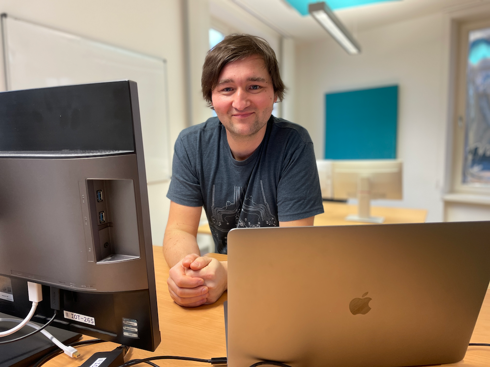

- Stellenbeschreibung: Chief of Innovation
- Bewerbungsunterlagen:
    - Bewerbungsschreiben
    - Lebenslauf
    - Portfolio

# Stellenbeschreibung _Chief Of Innovation_

_Innovation beginnt mit Ideen_

## Über mich

Ich bin leidenschaftlicher **Software-Engineer** und **Cloud-Engineer** mit
einer Passion für Observability. In meiner Freizeit experimentiere ich mit
**Mikrokontrollern** und **Autonomes Fahren** von Fahrzeugen. In
[Meetups][meetup-lorawan], Schulungen und Workshops teile ich meine
Erfahrungen mit Anderen und helfe ihnen, ihre eigenen Projekte zu
realisieren. **Es ist die Faszination für Software und Hardware, die mich
immer wieder dazu bringt, mich in neue Technologien einzuarbeiten und mich
mit anderen Menschen auszutauschen!** In meiner beruflichen Laufbahn hatte
ich die Möglichkeit, mit internationalen Teams zu arbeiten und Projekte in
verschiedenen Ländern zu realisieren. Im Bereich Marketing unterstütze ich
dabei, Prozesse zu automatisieren und die Effizienz zu steigern und
produziere auch selbst Inhalte in Bild, Text und Ton.

**Meine Fähigkeiten sind:**
1. Software-Entwicklung
2. Cloud Engineering
3. Software-Architektur
4. Consulting, Trainer, Speaker
5. Marketing, SEO, Content-Produktion

## Aufgabenschwerpunkte im Verlaufe der Zeit

Im Verlaufe der Zeit haben sich meine Themenschwerpunkte des Öfteren verlagert.
Die folgende Grafik visualisiert dies sehr gut. 2023 geb es einen starken
Fokus auf Software-Entwicklung und Cloud-Engineering. Im Jahr 2024 habe ich
mich zusätzlich auf Observability spezialisiert.

{ width=100% }

## Skills

### CINO SCHWERPUNKTE

- PoC
- Projektmanagement
- Erfahrung mit Produktentwicklung
- Erfahrung mit internationalen Teams und Projekten
- Marketingautomatisierung
- Content-Produktion

### Consulting

- Project management
- Requirement engineering
- Software architecture

### Trainer & Speaker

- Software development
- DevOps

### Marketing

- SEO
- Analytics, BI
- Content-Produktion
- Automatisierung

> **Mehr davon?** In meinem [CV](./2-curriculum-vitae) und
> [Portfolio](./2-portfolio.md) gehe ich auf weitere Details ein.

[meetup-lorawan]: https://www.meetup.com/de-DE/lorawan-leipzig-usergroup

---

## About me

I am a software developer with a passion for web development. I am currently working as a freelance developer and consultant.
I am also a member of the [Open Source Initiative](https://opensource.org/).
My main focus is on the development of web applications and the integration of web technologies into existing systems.
I am also interested in the development of mobile applications and the integration of web technologies into existing systems.
I am also interested in the development of mobile applications and the integration of web technologies into existing systems.

## Skills

### Software development

- Web development
- Web design
- Web accessibility
- Web performance
- Web security

### Consulting

- Web development
- Web design
- Web accessibility

## Experience

### Freelance developer and consultant

- 2019 - Present
- [example.de](https://example.de)
- [GitHub](https://github.com/example)

### Web developer

- 2018 - 2019
- [example.com](https://example.com)
- [GitHub](https://github.com/example/example)

## Main skills

- Web development
- Web design
- Web accessibility

## Buzzword bingo

JavaScript, Load testing, Usability, Accessibility, VueJS, Docker, Node JS, Performance, ESI, Varnish reverse proxy, Extbase, Deployment, Google Chrome Extensions, Regressive testing, functional testing, acceptance testing, unit testing, bdd, Codeception, PWA, Ionic Framework, jQuery, jQueryUI, git, Continuous Integration, Concourse CI, socket.io, Firebase, TYPO3 CMS, Lighttpd, Nginx, Code Review, PHP, Internet of Things, Raspberry PI, NAS, Zanox,
Semantic Web, RDF

> **⚠️ Please note** that this is not a complete list of all my skills.
> Take a look at my [CV](./2-curriculum-vitae) and [portfolio](./2-portfolio.md) for more information.
