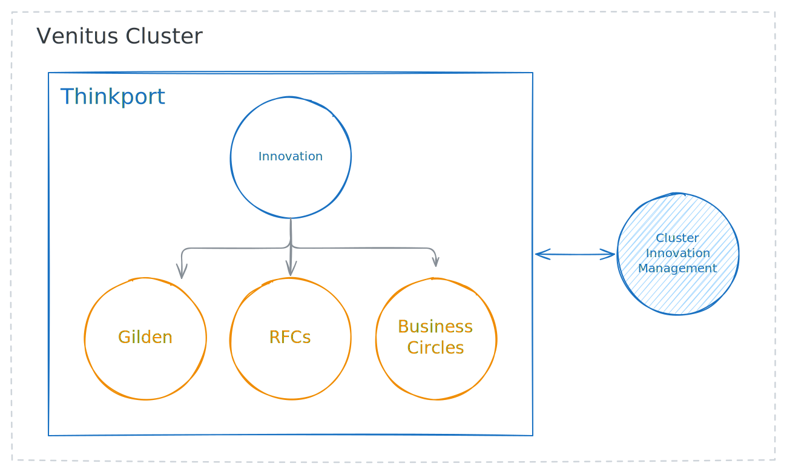

# Stellenbeschreibung 

## Chief Innovation and Network Officer (CINO) 

> Ich gestalte Innovation. Ich baue Netzwerke. Ich bringe Zukunft ins Unternehmen.

In meiner Rolle als Chief Innovation and Network Officer verantworte ich die 
strategische Entwicklung und Umsetzung von Innovationen und fördere aktiv den 
Aufbau eines starken, zukunftsorientierten Partnernetzwerks. Ich bin Impulsgeber, 
Möglichmacher und Brückenbauer zwischen Technologie, Menschen und Märkten.

⸻

## Was ich tue

### Innovation vorantreiben

Ich entwickle innovative Strategien, die Thinkport nachhaltig prägen. 
Dabei beobachte ich relevante Trends und Technologien, übersetze sie in greifbare 
Chancen und setze sie in marktfähige Produkte, Services oder Prozesse um. 
Ich schaffe Räume für Kreativität – durch interne Innovationsformate, 
agile Methoden und interdisziplinäre Teams.

### Netzwerke aufbauen und nutzen

Ich knüpfe und pflege Beziehungen zu Start-ups, Hochschulen, unseren 
Partnern im CLuster und strategischen Partnern. Ich repräsentiere das 
Unternehmen auf Konferenzen, Messen und Events – immer auf der Suche nach 
Impulsen, Kooperationen und gemeinsamen Zukunftsprojekten.

### Zusammenarbeit ermöglichen

Ich arbeite eng mit Führungskräften und Teams aus allen Bereichen zusammen. Ich 
verstehe mich als Schnittstelle zwischen Strategie und Umsetzung. Durch offene 
Kommunikation und mutige Experimente fördere ich eine Kultur der Innovation – 
geprägt von Vertrauen, Lernen und Verantwortung. Dazu zählt auch die Zusammenarbeit
mit unseren Partnern im Cluster.

⸻

## Was mich auszeichnet

- Als Mitbegründer der Gilden und RFCs habe ich das Innovationsmanagement bei Thinkport 
  maßgeblich geprägt. 
- Ich denke unternehmerisch, arbeite strukturiert und kommuniziere überzeugend – intern wie extern.
- Ich liebe es, Netzwerke zu pflegen, Trends zu analysieren und neue Dinge einfach mal auszuprobieren.
- Ich kann Menschen begeistern, Perspektiven zusammenbringen und Ideen Realität werden lassen.
- Ich bringe mehrjährige Erfahrung im Innovationsmanagement, in der digitalen Transformation oder im Aufbau neuer Geschäftsfelder mit.

## Aufgaben darüber hinaus (CINO plus)

### Technische Umsetzung von PoCs

Durch meinen technischen Background und meine Erfahrung im Innovationsmanagement
kann ich neue Geschäftsmodelle schnell erproben.

### Marketing Automatisierung

Durch meine Erfahrung im Marketing und in der Automatisierung von Prozessen
kann ich Marketing- und Vertriebsprozesse effizienter gestalten.

### Wissensmanagement

Durch Standarisierung und Automatisierung von Prozessen kann ich Wissen 
schneller und effizienter bereitstellen. Gilden und RFCs sind ein
Werkzeug, um Wissen zu teilen und zu verbreiten und Innovationen zu fördern.

⸻

## Wofür ich stehe

1. Ich glaube daran, dass Innovation kein Zufall ist – sondern das Ergebnis von Neugier, Offenheit und Zusammenarbeit.
2. Ich bringe Struktur ins Neue, ohne es zu ersticken.
3. Ich vernetze Menschen, Ideen und Technologien zu etwas Größerem.
